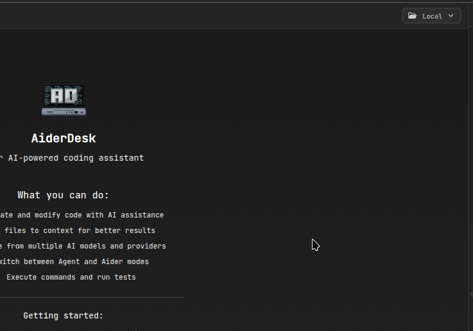
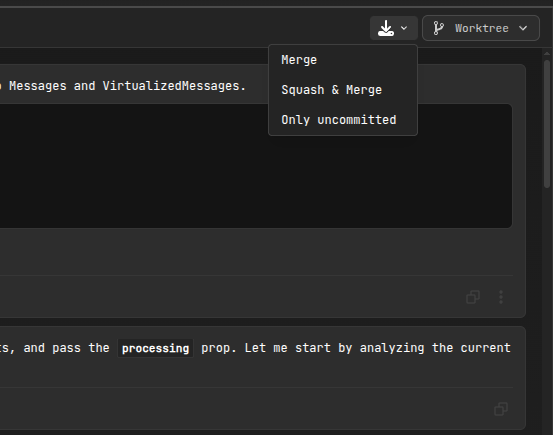
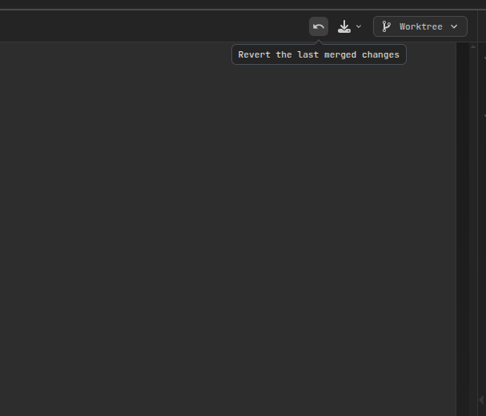

# Git Worktrees

AiderDesk's Git Worktrees feature provides a powerful, isolated development environment that allows you to work on multiple features or experiments simultaneously without affecting your main project branch. This feature leverages Git's native worktree functionality to create separate working directories while sharing the same repository history.

## Overview

Git worktrees enable you to:

- **Work in Isolation**: Create separate working directories for each task or feature
- **Preserve Main Branch**: Keep your main project directory clean and stable
- **Switch Context Easily**: Move between different worktrees without losing progress
- **Safe Experimentation**: Test changes without risking your main codebase
- **Flexible Integration**: Choose how to integrate changes back to the main branch

## How It Works

When you create a task with worktree mode enabled, AiderDesk:

1. **Creates a Worktree**: Generates a new working directory at `.aider-desk/tasks/{taskId}/worktree`
2. **Isolates Changes**: All file modifications, commits, and AI interactions happen within this worktree
3. **Maintains Connection**: The worktree shares the same Git repository history but has its own working state
4. **Preserves Main**: Your main project directory remains untouched until you explicitly merge changes

## Working Modes

Each task in AiderDesk can operate in one of two modes:

### Local Mode
- Works directly in your main project directory
- Traditional workflow where changes affect the main branch immediately
- Suitable for quick fixes and simple changes

### Worktree Mode
- Creates an isolated environment for the task
- All changes are contained within the worktree
- Requires explicit merge to integrate changes back to main
- Ideal for complex features, experiments, and parallel development

## Worktree Workflow

### 1. Creating a Worktree Task



1. **Create New Task**: Click "New Task" in the project interface
2. **Select Worktree Mode**: Choose the worktree icon (🌿) instead of local mode (📁)
3. **Automatic Setup**: AiderDesk automatically creates the worktree and switches to it

### 2. Working in the Worktree

Once in worktree mode:

- **Isolated Environment**: All file edits, AI prompts, and commits happen in the worktree
- **Full Git Functionality**: You can commit, branch, and use all Git features within the worktree
- **AI Integration**: Aider operates within the worktree context, unaware of the isolation
- **Context Management**: Context files are managed relative to the worktree directory

### 3. Integration Options

When you're ready to integrate your worktree changes, AiderDesk provides three integration options:



#### Option 1: Standard Merge
- **Process**: Rebase worktree onto main, then fast-forward merge
- **Result**: Preserves all individual commits from the worktree
- **Use Case**: When you want to maintain detailed commit history
- **Command**: `git merge --ff-only`

#### Option 2: Squash & Merge
- **Process**: Rebase worktree onto main, then squash into single commit
- **Result**: Creates one clean commit with AI-generated message
- **Use Case**: When you want a clean, linear main branch history
- **Command**: `git merge --squash`

#### Option 3: Only Uncommitted Changes
- **Process**: Stash uncommitted changes and apply to main branch
- **Result**: Transfers work-in-progress without merging commits
- **Use Case**: When you want to move ongoing work to main branch
- **Command**: `git stash` + `git stash apply`

## Merge Operations in Detail

### Pre-Merge Safety Checks

Before any merge operation, AiderDesk performs several safety checks:

1. **Conflict Detection**: Analyzes potential merge conflicts using `git merge-tree`
2. **Uncommitted Changes Handling**: Safely stashes changes from both worktree and main
3. **State Preservation**: Records commit hashes for potential revert operations

### Merge Process

1. **Stash Management**:
   - Stashes uncommitted changes from worktree
   - Stashes any uncommitted changes from main branch
2. **Rebase**: Rebases worktree onto main branch to incorporate latest changes
3. **Merge**: Performs the selected merge operation (standard or squash)
4. **Restore**: Applies stashed changes back to both branches
5. **Cleanup**: Removes temporary stashes

### Conflict Resolution

If conflicts are detected:

- **Pre-Merge Detection**: AiderDesk identifies potential conflicts before merging
- **Detailed Reporting**: Shows which files conflict and why
- **User Guidance**: Provides clear instructions for manual resolution
- **Safe Abort**: Can abort the operation without losing work

## Revert Operations

AiderDesk provides a safety net with merge revert functionality:



### How Revert Works

1. **State Tracking**: Each merge operation saves a `MergeState` with pre-merge commit hashes
2. **Revert Process**:
   - Resets main branch to pre-merge state
   - Resets worktree to pre-merge state
   - Restores uncommitted changes in both locations
3. **Selective Cleanup**: Removes merge-related stashes while preserving work

### When to Use Revert

- **Merge Issues**: When merge results are unexpected
- **Testing Changes**: When you want to test a merge and then undo it
- **Accidental Merge**: When changes were merged prematurely
- **Integration Problems**: When merged changes break the main branch

## Advanced Features

### Git Operations

All standard Git operations work within worktrees:

- **Pull/Push**: Sync with remote repositories
- **Commit History**: View and navigate commit history
- **Diff Generation**: Generate diffs for AI analysis
- **Rebase Operations**: Rebase worktree branches as needed

### AI Integration

The AI system works seamlessly with worktrees:

- **Context Awareness**: AI operates within worktree context
- **File Operations**: All file edits happen in the worktree
- **Commit Messages**: AI can generate commit messages based on worktree changes
- **Code Analysis**: AI analyzes code within the worktree isolation

## Best Practices

### When to Use Worktrees

**Ideal for:**
- Complex features requiring multiple commits
- Experimental changes that might not be merged
- Parallel development on multiple features
- Code reviews and testing before integration
- Learning and experimentation with AI assistance

**Not ideal for:**
- Quick bug fixes that need immediate deployment
- Simple changes that don't warrant isolation
- Situations where immediate main branch updates are required

### Worktree Management Tips

1. **Descriptive Task Names**: Use clear task names to identify worktree purposes
2. **Regular Integration**: Merge completed work regularly to avoid divergence
3. **Clean Up**: Remove completed worktree tasks to free up disk space
4. **Backup Important Work**: Ensure important worktree changes are committed

### Merge Strategy Guidelines

- **Standard Merge**: Use when commit history provides value (feature development)
- **Squash Merge**: Use for clean integration (bug fixes, simple features)
- **Uncommitted Only**: Use for transferring work-in-progress between contexts

## Troubleshooting

### Common Issues

#### Worktree Creation Fails
- **Cause**: Repository not initialized or no initial commit
- **Solution**: AiderDesk automatically initializes repository and creates initial commit

#### Merge Conflicts
- **Cause**: Divergent changes in same files
- **Solution**: Resolve conflicts manually in worktree, then retry merge

#### Revert Fails
- **Cause**: Merge state not available or corrupted
- **Solution**: Manual reset using Git commands or create new worktree

#### Disk Space
- **Cause**: Multiple worktrees with large file changes
- **Solution**: Regular cleanup of completed worktree tasks

### Recovery Procedures

1. **Manual Git Operations**: Use Git commands directly in worktree directory
2. **Worktree Removal**: Manually remove worktree using `git worktree remove`
3. **State Reset**: Reset main branch using recorded commit hashes
4. **Backup Recovery**: Restore from Git reflog if needed

## Technical Details

### Worktree Structure

```
project/
├── .git/
├── .aider-desk/
│   └── tasks/
│       └── {taskId}/
│           ├── settings.json
│           └── worktree/
│               ├── .git (file pointing to main .git)
│               └── (project files)
└── (main project files)
```

### State Management

- **Task Settings**: Stored in `.aider-desk/tasks/{taskId}/settings.json`
- **Merge State**: Preserved for revert operations
- **Worktree Metadata**: Tracked in main Git repository
- **Stash Management**: Temporary stashes with unique identifiers

### Performance Considerations

- **Disk Usage**: Each worktree duplicates working directory files
- **Git Operations**: Slightly slower due to worktree management overhead
- **Memory Usage**: Minimal additional memory overhead
- **Network Operations**: No impact on push/pull operations

## Integration with IDE Plugins

The IDE integration plugins work seamlessly with worktrees:

- **File Context**: Context files are tracked relative to worktree
- **Automatic Sync**: Editor changes sync to worktree when in worktree mode
- **Path Resolution**: Plugin paths automatically resolve to worktree directory
- **Mode Awareness**: Plugins detect and adapt to current working mode

## Conclusion

Git worktrees in AiderDesk provide a robust, professional-grade development environment that enables safe, isolated development while maintaining seamless integration with your main project. Whether you're working on complex features, experimenting with AI assistance, or managing parallel development streams, worktrees offer the flexibility and safety needed for modern software development.

The combination of isolation, flexible integration options, and safety features like revert operations makes worktrees an essential tool for serious development workflows in AiderDesk.
