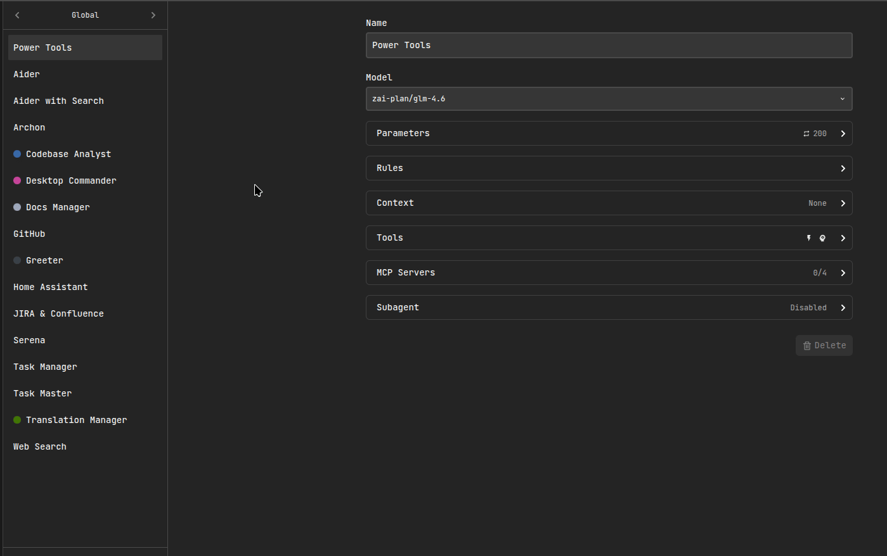
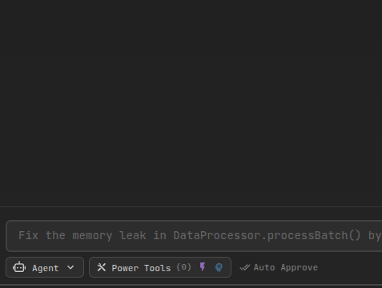

# Memory

AiderDesk Memory lets the agent **store and retrieve durable, project-scoped knowledge** across tasks. This helps the agent remember stable preferences (like formatting rules), architectural decisions, and recurring codebase patterns—without you repeating them every time.

## Important prerequisites

Memory only works when **both** are enabled:

1. **Enable Memory in Settings**: `Settings → Memory → Enabled`
2. **Enable Memory tools for the active Agent profile**:
   - `Settings → Agent → (select your profile) → Use Memory Tools`
   - Or from the in-chat Agent selector: `AgentSelector → Use memory tools`

If Memory is enabled in Settings but **Memory tools are disabled** for the current profile, the agent will not be able to read or write memories.

## Configure Memory (MemorySettings)

Open: `Settings → Memory`

- **Enabled**: Turns the memory subsystem on/off.
- **Provider / Model**: Selects the local embedding model used to convert text into vectors.
- **Max distance**: Similarity threshold used when retrieving memories (lower = stricter matching).
- **Embedding progress**: On first run (or after model changes) AiderDesk may download/cache the embedding model and/or re-embed existing memories.

## Using Memory in Agent Mode

### Enable “Use Memory Tools” in Agent Settings

In `Settings → Agent`, enable **Use Memory Tools** for the agent profile you will use.

### Enable “Use memory tools” in AgentSelector

You can also toggle memory tools per-task from the Agent selector.

## Memory Tools

When enabled, the agent can use these tools:

- `retrieve_memory`: Search for relevant memories for the current task.
- `store_memory`: Save a new memory (preference / decision / pattern).
- `list_memories`: List stored memories (optionally filtered by type).
- `delete_memory`: Delete a specific memory by ID.

### Recommended workflow (must-follow)

- **At the beginning of a task**: the agent should run `retrieve_memory` to check for relevant context (preferences, patterns, prior decisions).
- **After the task is completed**: the agent should run `store_memory` to save **important general outcomes** that will be helpful later.

What to store:
- Durable **user preferences** (formatting, frameworks, naming, “always do X / never do Y”)
- Stable **architectural decisions** (e.g., “we use Zod for validation”, “REST client lives in src/renderer/src/api/...”, etc.)
- Reusable **codebase patterns** (how errors are handled, logging conventions, common abstractions)

What *not* to store:
- One-off task status updates
- Temporary debugging notes
- Long logs/stack traces
- Secrets, tokens, credentials, or personal data
- Anything that is only relevant to a single prompt

## Technical overview (how it works)

AiderDesk Memory is implemented as a **local vector search** system:

1. When a memory is stored, AiderDesk generates an **embedding** (a numeric vector) for the content using a local embedding model.
2. The memory text + embedding are stored in a local vector database.
3. When retrieving, your query is embedded and compared to stored vectors using similarity search.

### Vector database

AiderDesk uses **LanceDB** as the local vector database. Memories are stored locally on your machine and queried with similarity search.

### Local embeddings

Embeddings are produced via `@huggingface/transformers` using the configured model in `MemorySettings`. The model is cached locally (first run may take longer).

## Managing stored memories

In `Settings → Memory → Memories`, you can:

- Browse memories
- Filter by project
- Delete individual memories or clear a project’s memories

This is useful if you want to reset what the agent has learned or remove outdated information.
