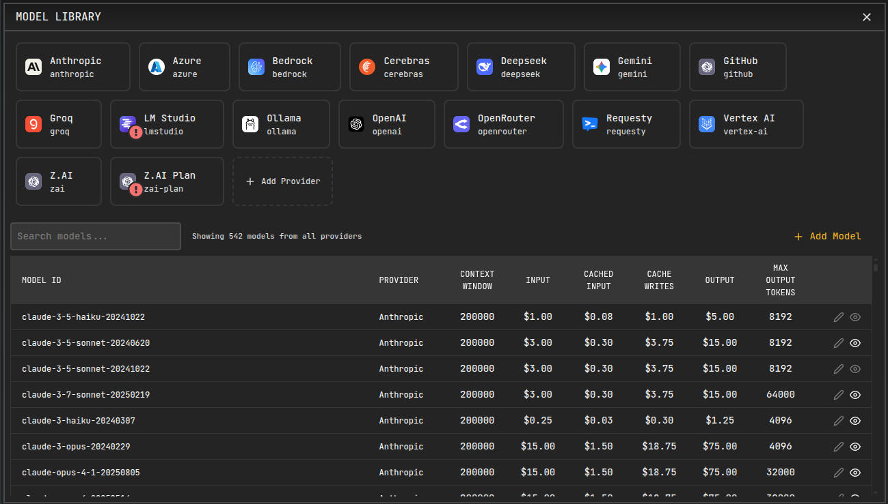
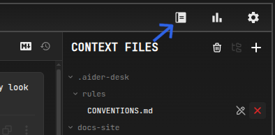

# Model Library

The Model Library is AiderDesk's advanced provider and model management system that gives you complete control over your AI model configuration. It allows you to manage multiple provider profiles, add custom models, configure costs, and organize your model collection efficiently.

## Features Overview

- **Multiple Provider Profiles**: Create multiple profiles for the same provider with different configurations
- **Custom Model Management**: Add models that aren't automatically discovered by the system
- **Cost and Token Configuration**: Set custom pricing and token limits for accurate cost tracking
- **Model Organization**: Hide irrelevant models and organize by provider profiles
- **Dynamic Model Loading**: Automatically discover available models for most providers
- **Unified Interface**: Manage all providers and models from a single, intuitive interface

## Accessing the Model Library

You can access the Model Library in several ways:

1. **Top Bar Icon**: Click the Model Library icon in the top bar (looks like a database/models icon)
2. **Model Selector**: Cog icon right from model selector
3. **Onboarding**: During initial setup, you'll be guided through provider configuration

## Provider Profiles

### What are Provider Profiles?

Provider profiles allow you to create multiple configurations for the same provider type. This is useful for:

- **Work and Personal Accounts**: Separate OpenAI profiles for work and personal use
- **Different Regions**: Multiple Azure profiles for different Azure regions
- **Provider Variations**: Different OpenAI-compatible providers with unique prefixes

### Creating Multiple Profiles

#### Example: Multiple OpenAI Accounts

1. **First Profile (Personal)**:
   - Profile ID: `openai-personal`
   - Profile Name: "Personal OpenAI"
   - API Key: `sk-...personal-key...`
   - Models: `gpt-4`, `gpt-3.5-turbo`

2. **Second Profile (Work)**:
   - Profile ID: `openai-work`
   - Profile Name: "Work OpenAI"
   - API Key: `sk-...work-key...`
   - Models: `gpt-4`, `gpt-4-turbo`

#### Example: Multiple OpenAI-Compatible Providers

1. **Local LLM Provider**:
   - Profile ID: `local-llm`
   - Profile Name: "Local LLM Server"
   - Base URL: `http://localhost:8080/v1`
   - API Key: `local-key`
   - Models: `llama-2-7b`, `codellama-13b`

2. **Cloud Provider**:
   - Profile ID: `cloud-provider`
   - Profile Name: "Cloud API Provider"
   - Base URL: `https://api.cloud-provider.com/v1`
   - API Key: `cloud-api-key`
   - Models: `gpt-4`, `claude-3-sonnet`

### Profile Configuration

Each provider profile includes:

- **Profile ID**: Unique identifier (auto-generated or custom)
- **Profile Name**: Display name for easy identification
- **Provider Parameters**: API keys, endpoints, and provider-specific settings
- **Custom Headers**: Additional HTTP headers for API requests
- **Model Prefix**: Automatically generated based on profile ID

## Custom Model Management

### When to Add Custom Models

Some providers don't automatically discover all available models:

- **Azure OpenAI**: Models must be manually added after deployment
- **Private Models**: Custom-trained or fine-tuned models
- **New Models**: Recently released models not yet in the system
- **Specialized Models**: Models with specific configurations

### Adding Custom Models

#### Example: Azure OpenAI Models

Azure OpenAI requires manual model addition since models are deployed to specific resources:

1. **Deploy a model in Azure Portal** (e.g., `gpt-4`, `gpt-35-turbo`)
2. **Open Model Library** → Select your Azure provider profile
3. **Click "Add Model"** and configure:
   - **Model ID**: `gpt-4`
   - **Max Input Tokens**: `128000`
   - **Max Output Tokens**: `4096`
   - **Input Cost per Token**: `0.00003`
   - **Output Cost per Token**: `0.00006`

#### Example: Fine-Tuned Model

For a custom fine-tuned model:

1. **Model ID**: `gpt-3.5-turbo-my-finetune`
2. **Provider**: Select your OpenAI profile
3. **Token Limits**: Match base model or custom limits
4. **Cost**: Set based on your provider's pricing for fine-tuned models

### Model Configuration Options

- **Model ID**: Unique identifier (must match provider's model name)
- **Max Input Tokens**: Context window size
- **Max Output Tokens**: Maximum response length
- **Input Cost per Token**: Cost per 1M input tokens
- **Output Cost per Token**: Cost per 1M output tokens
- **Cache Read Cost**: Cost for cached tokens (if supported)
- **Hidden**: Hide model from selectors but keep configuration

## Cost and Token Configuration

### Why Configure Costs?

Accurate cost configuration enables:

- **Usage Tracking**: Monitor spending across projects and models
- **Budget Management**: Set and track usage budgets
- **Cost Optimization**: Compare costs between different models
- **Reporting**: Generate detailed cost reports

### Finding Model Costs

- **Provider Documentation**: Check official pricing pages
- **Model Library**: Some costs are pre-configured for popular models
- **API Responses**: Some providers include pricing in model info
- **Community Resources**: GitHub, forums, and pricing comparison sites

### Example Cost Configurations

#### OpenAI GPT-4
- **Input Cost**: $0.03 per 1K tokens ($0.00003 per token)
- **Output Cost**: $0.06 per 1K tokens ($0.00006 per token)
- **Context Window**: 128,000 tokens

#### Anthropic Claude 3 Opus
- **Input Cost**: $0.015 per 1K tokens ($0.000015 per token)
- **Output Cost**: $0.075 per 1K tokens ($0.000075 per token)
- **Context Window**: 200,000 tokens

## Dynamic vs Manual Model Loading

### Dynamic Model Loading

Most providers automatically discover available models:

- **OpenAI**: Fetches models from `/models` endpoint
- **Anthropic**: Uses known model list
- **Gemini**: Queries available models
- **OpenRouter**: Loads all available models
- **Groq**: Fetches from provider API

### Manual Model Loading

Some providers require manual model addition:

- **Azure OpenAI**: Models deployed to specific resources
- **Ollama**: Models must be pulled locally first
- **LM Studio**: Models loaded in the application
- **Custom Providers**: Provider-specific discovery methods

## Model Organization

### Hiding Models

Hide models that you don't use to clean up the model selector:

1. **Select Model** in the Model Library
2. **Toggle "Hidden"** to hide/show the model
3. **Hidden models** won't appear in model selectors but remain configured

### Provider Organization

- **Profile Selection**: Filter models by provider profile
- **Search**: Find models by name or ID
- **Sort**: Organize by provider, cost, or token limits
- **Bulk Actions**: Hide/show multiple models at once

## Advanced Use Cases

### Multi-Provider Setup

Configure multiple providers for redundancy and cost optimization:

1. **Primary Provider**: OpenAI GPT-4 for quality
2. **Backup Provider**: Anthropic Claude for reliability
3. **Cost-Optimized**: Groq for fast, cheap responses
4. **Local**: Ollama for privacy and offline use

### Team Configuration

Set up profiles for different team needs:

1. **Development Profile**: Fast, cheap models for testing
2. **Production Profile**: High-quality models for production code
3. **Research Profile**: Advanced models for R&D
4. **Compliance Profile**: On-premise or compliant cloud providers

### Regional Compliance

Configure providers based on data residency requirements:

1. **EU Profile**: Azure West Europe, GDPR compliant
2. **US Profile**: Azure East US, HIPAA compliant
3. **Asia Profile**: Azure Japan East, local data residency

## Integration with Other Features

### Model Selection

- **Unified Selector**: All configured models appear in model selectors
- **Profile Prefixing**: Models use profile-specific prefixes
- **Recent Models**: Frequently used models appear at the top
- **Custom Models**: Manually added models are fully integrated

### Cost Tracking

- **Automatic Calculation**: Costs calculated based on actual usage
- **Per-Project Tracking**: Monitor costs per project
- **Model Comparison**: Compare costs between different models
- **Budget Alerts**: Set up cost alerts and limits

### Usage Analytics

- **Token Usage**: Track input/output tokens per model
- **Cost Analysis**: Analyze spending patterns
- **Performance Metrics**: Monitor model performance and costs
- **Reporting**: Export usage and cost reports

## Best Practices

### Profile Management

1. **Descriptive Names**: Use clear, descriptive profile names
2. **Consistent IDs**: Use consistent profile ID patterns
3. **Regular Cleanup**: Remove unused profiles and models
4. **Documentation**: Document custom configurations for teams

### Cost Configuration

1. **Regular Updates**: Keep costs updated with provider changes
2. **Buffer Costs**: Add small buffer to estimated costs
3. **Monitor Usage**: Regularly review usage and costs
4. **Optimize Selection**: Choose cost-effective models for tasks

### Model Organization

1. **Hide Unused**: Hide models you never use
2. **Regular Review**: Periodically review model configurations
3. **Backup Configs**: Export configurations for backup
4. **Team Standards**: Establish team-wide model standards

## Troubleshooting

### Common Issues

**Models Not Loading**:
- Check API keys and credentials
- Verify network connectivity
- Review provider-specific requirements

**Cost Calculations Wrong**:
- Update token costs in model configuration
- Verify token limits match provider specifications
- Check for cached token costs

**Profile Conflicts**:
- Ensure unique profile IDs
- Check for duplicate model configurations
- Verify provider-specific settings

## Related Features

- [Providers Configuration](../configuration/providers.md) - Basic provider setup
- [Agent Mode](../agent-mode/) - Using models in Agent Mode
- [Usage Dashboard](./usage-dashboard.md) - Track model usage and costs
- [Settings](../configuration/settings.md) - Configure models per project