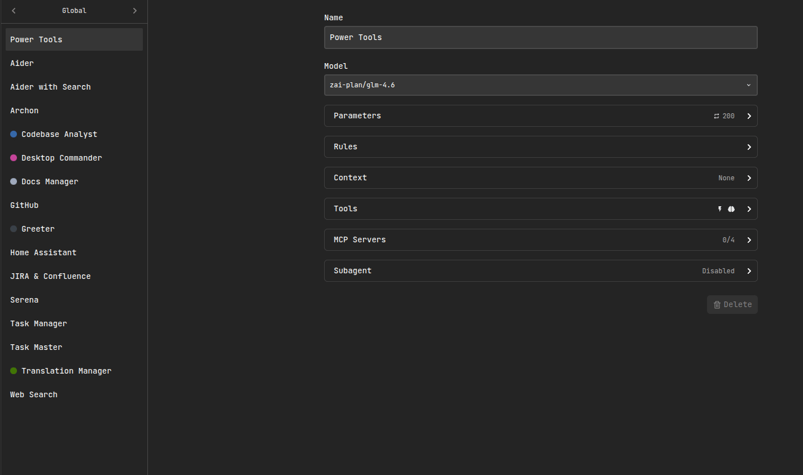
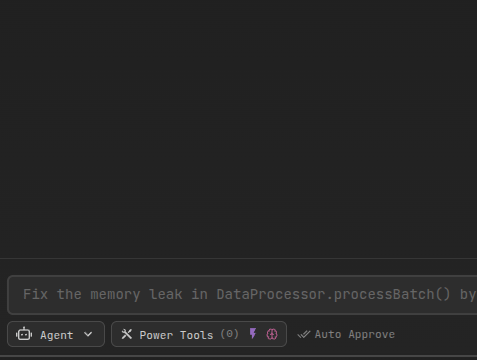

# Skills

Skills let you extend the agent with **reusable, on-demand expertise**. A skill is a folder that contains instructions (and optionally scripts and reference materials) that the agent can load when it’s relevant.

Unlike pasting huge guides into the chat, skills follow a **progressive disclosure** pattern:

- On startup, the agent only preloads each skill’s **metadata** (name + description), which is token-efficient.
- When a task matches, the agent can load the skill by reading its `SKILL.md` (and any referenced files) from disk.

## What Skills are good for

Skills work especially well for:

- **Repeatable workflows** you want the agent to follow consistently (e.g., “how we do releases”, “how we write PR descriptions”, “our brand guidelines”).
- **Domain-specific playbooks** that don’t belong in the model’s general knowledge (internal processes, project conventions).
- **Tasks that benefit from executable helpers**: skills can include scripts that the agent can run for deterministic, repeatable steps.
- **Reducing context bloat**: instead of loading everything up-front, the agent only loads the skill contents when needed.

Simon Willison has a good overview of why this pattern is powerful and how it compares to heavier integrations: https://simonwillison.net/2025/Oct/16/claude-skills/

For deeper technical context and best practices, see Anthropic’s engineering article:
https://www.anthropic.com/engineering/equipping-agents-for-the-real-world-with-agent-skills

## Where Skills live

AiderDesk loads skills from two locations:

- **Home-level skills**: `~/.aider-desk/skills/`
- **Project-level skills**: `.aider-desk/skills/` (in your project root)

This lets you keep personal skills globally, while sharing project-specific skills with your repository.

## Skill structure

Each skill is a directory, typically shaped like:

```
{skills-root}/
  {skill-name}/
    SKILL.md
    references/
    scripts/
    ...
```

At minimum, a skill needs `SKILL.md`. It should start with YAML frontmatter containing at least a `name` and `description`.

## Important prerequisites

Skills only work when **Skills Tools are enabled** for the active agent profile.

You can enable them in either place:

1. **Agent Settings**: `Settings → Agent → (select your profile) → Use Skills Tools`
2. **Per-task via AgentSelector**: `AgentSelector → Use skills tools`

If skills exist on disk but **Skills Tools are disabled**, the agent won’t be able to discover or load them.

## Using Skills in Agent Mode

### Enable “Use Skills Tools” in Agent Settings

In `Settings → Agent`, enable **Use Skills Tools** for the agent profile you will use.



### Enable “Use skills tools” in AgentSelector

You can also toggle skills tools per-task from the Agent selector.



## Skills Tools

When enabled, the agent can:

- **Discover installed skills** (using skill metadata).
- **Activate a skill** when it’s relevant by loading its `SKILL.md` and following its instructions.

In practice this means the agent can selectively load the right “mini-manual” for the job, instead of relying on generic behavior.

### Recommended workflow

- If you use skills frequently, keep their descriptions **specific and action-oriented** so the agent can select them correctly.
- Prefer **small, composable skills** over one giant document.
- Move rarely-needed details into additional files referenced from `SKILL.md`.

## Security notes

Skills can include executable scripts and external links. Treat them like code:

- Install skills only from **trusted sources**.
- If you didn’t write a skill, **audit it** before using it (especially scripts and any network access).
- For shared repos, prefer keeping skills **project-scoped** so they travel with the codebase and are reviewable.

## Further reading

- Simon Willison: Claude Skills are awesome, maybe a bigger deal than MCP — https://simonwillison.net/2025/Oct/16/claude-skills/
- Anthropic Engineering: Equipping agents for the real world with Agent Skills — https://www.anthropic.com/engineering/equipping-agents-for-the-real-world-with-agent-skills
